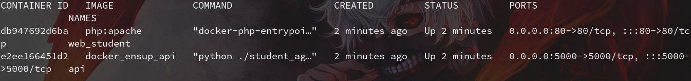

# TP ENSUP DOCKER


## Caracteristiques
 - Docker
 - Python
 - PHP


## Utilisation

Afin de lancer le projet il suffit d'executer la commande suivante qui lancera l'ensemble des containers :
```
docker-compose up -d
```
Un fois les containers lancer il vous suffit d'acceder a l'adresse suivante pour acceder a la partie frontend du site :

Site internet : http://localhost


## Constations

une fois le docker compose executer, nous constatons qu'il y a deux containers actif :


